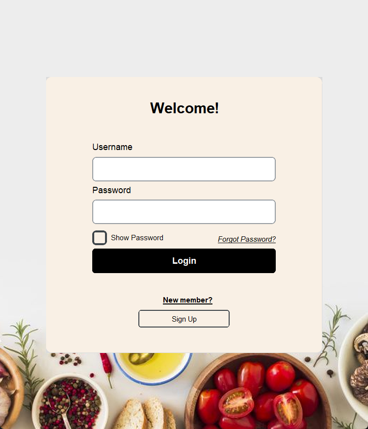
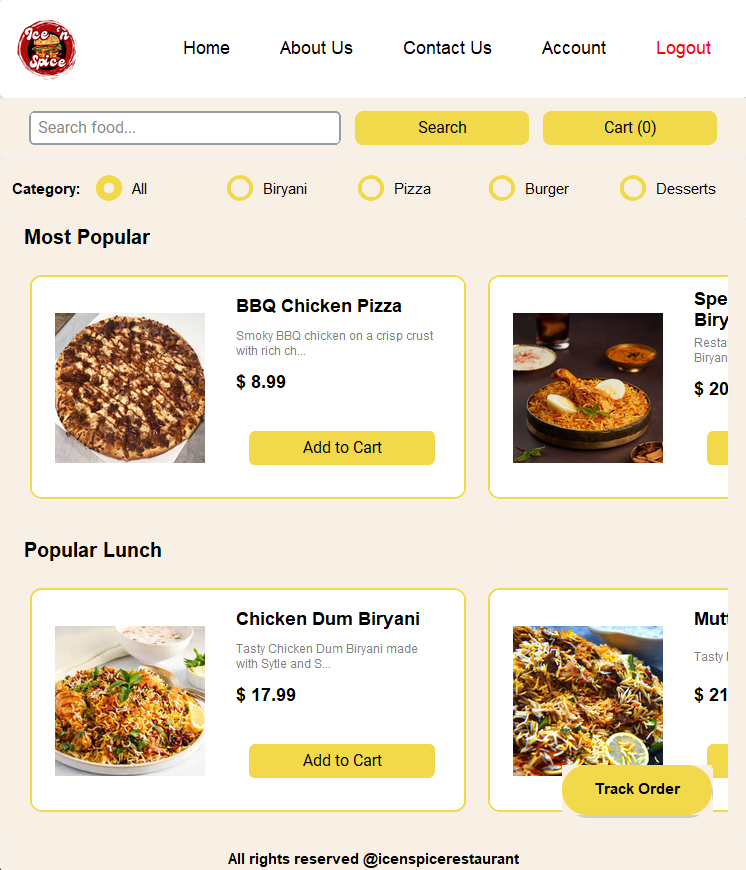
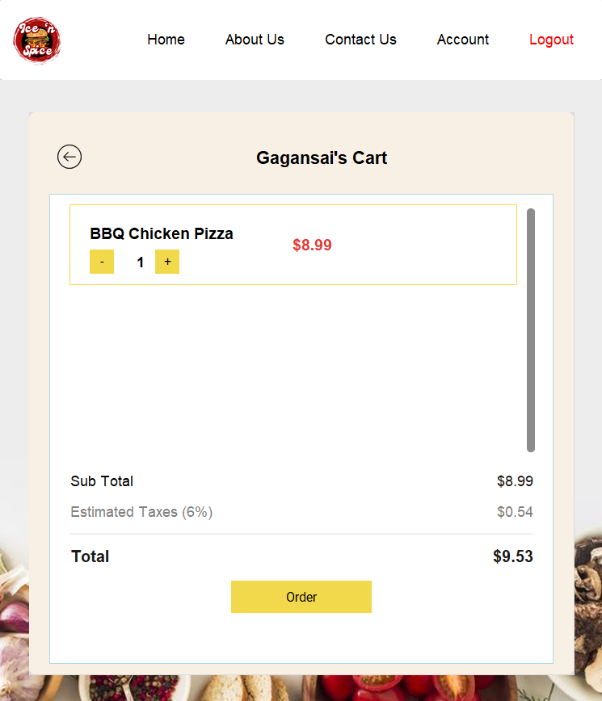

# Ice & Spice Restaurant Management System

## About
Ice & Spice Restaurant Management System is a comprehensive solution for managing restaurant operations. Built with Python and CustomTkinter, it provides separate interfaces for customers and administrators, handling everything from menu browsing to order management and analytics.

## Contributors
- [GAGANSAI BIRRU](https://github.com/thisisgaganbirru)
- [Other Contributors]

## Features
### Authentication System
- Welcome page with getting started flow
- User login with role-based access
- New user registration
- Password recovery system
    - Email verification
    - Security question verification
    - Password reset functionality

### Welcome Page

- Initial landing page
- Get Started button to begin

### Login System

- User authentication
- Role-based access (Customer/Admin)

()
- Forgot password recovery:
    1. Email verification
    2. Security validation
    3. New password setup
    4. Automatic login after reset

### Customer Features
- Browse restaurant menu 


- Place and customize orders


- Track order status


### About Us

- Restaurant history and vision
- Team information
- Location details
- Operating hours
- Special events and announcements

### Contact Support

- Direct message support
- Support ticket creation
- Track support requests
- View previous communications

### Account Management

- Personal Profile Management

    - Edit profile information
    - Update contact details
    

    
    - Change password
    

    ### Order History
    
    - View all previous orders
    - Filter by date range
    - Order details and status
    - Reorder functionality

    ### Support Request History
    
    - View all support tickets
    - Track ticket status
    - Response history
    - Follow-up options


### Admin Features
- Menu management


- Order management


- Customer management


- Reports and analytics


- Support ticket system


## Installation & Setup

1. Clone the repository:
```bash
git clone https://github.com/thisisgaganbirru/Restaurant-Ice-n-Spice.git
cd IcenSpice_Restaurant
```

2. Create and activate virtual environment:
```bash
python -m venv venv
.\venv\Scripts\activate
```

3. Run the setup script to install dependencies:
```bash
python setupRun.py
```
   Or manually install using requirements:
```bash
python -m pip install --upgrade pip
pip install -r requirements.txt
```

4. Set up the MySQL database using the provided schema

5. Run the application:
```bash
python start.py
```

## Technologies Used
- Python 3.10+
- CustomTkinter for GUI
- MySQL Database
- Pillow for image processing
- Watchdog for development auto-reload

## Project Structure
```
IcenSpice_Restaurant/
├── images/
├── documentation/
│   └── screenshots/
├── *.py (Application source files)
├── requirements.txt
├── .gitignore
└── README.md
```


## Screenshots
Here are some key features of the application:

## Application Interfaces

### Customer Interface
| Feature | Screenshot | Description |
|---------|------------|-------------|
| Menu Browsing |  | - Browse full menu<br>- View item details<br>- Check prices |
| Order Management |  | - Place new orders<br>- Customize items<br>- Add to cart |
| Order Tracking |  | - Real-time status<br>- Delivery estimates<br>- Order details |
| Account Profile |  | - Personal details<br>- Edit profile<br>- Security settings |
| Order History |  | - Past orders<br>- Filter by date<br>- Reorder option |
| Support System |  | - Create tickets<br>- Track status<br>- View responses |
| About Us |  | - Restaurant info<br>- Location details<br>- Operating hours |
| Contact |  | - Support requests<br>- Direct messaging<br>- Feedback |

### Admin Interface
| Feature | Screenshot | Description |
|---------|------------|-------------|
| Dashboard |  | - Overview stats<br>- Quick actions<br>- Recent activity |
| Orders |  | - Order management<br>- Status updates<br>- Order details |
| Menu |  | - Item management<br>- Price updates<br>- Category control |
| Customers |  | - Customer database<br>- Profile management<br>- Order history |
| Reports |  | - Sales analytics<br>- Customer insights<br>- Performance metrics |
| Support |  | - Ticket management<br>- Customer communication<br>- Response tracking |


## Version Control
### .gitignore Configuration
The project includes a `.gitignore` file to exclude unnecessary files:
```
# Python
__pycache__/
*.py[cod]
*$py.class
*.so
.Python
build/
develop-eggs/
dist/
downloads/
eggs/
.eggs/
lib/
lib64/
parts/
sdist/
var/
wheels/
*.egg-info/
.installed.cfg
*.egg

# Virtual Environment
venv/
ENV/

# IDE
.vscode/
.idea/
*.swp
*.swo

# Environment Variables
.env

# Database
*.sqlite3
*.db

# Logs
*.log
logs/

# Media
media/
uploads/

# Local development
local_settings.py
db.sqlite3
db.sqlite3-journal

# Distribution
*.spec
```

This configuration helps maintain a clean repository by excluding:
- Compiled Python files
- Virtual environments
- IDE settings
- Environment variables
- Database files
- Log files
- Media uploads
- Local development files
